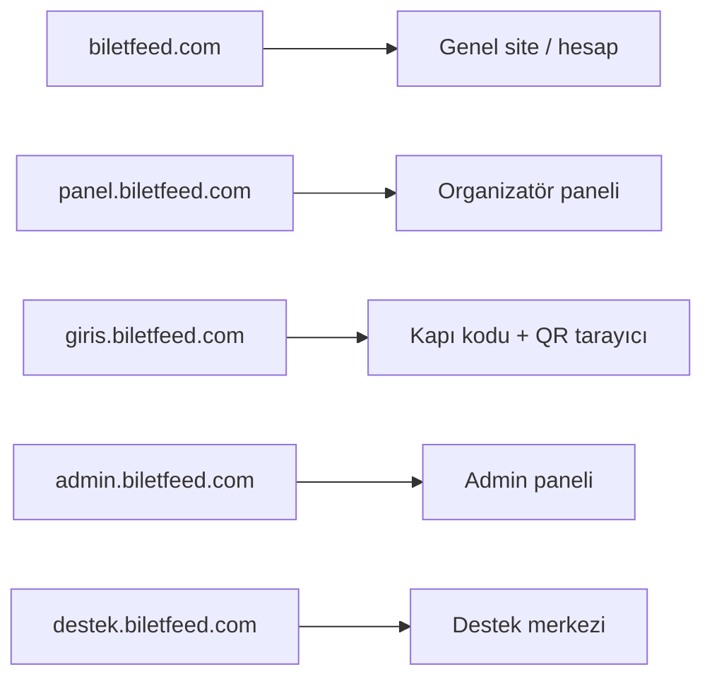

# Alt alanlar: giris + admin

## Hedef mimari




| Domain                 | Rol                                                            |
| ---------------------- | -------------------------------------------------------------- |
| `biletfeed.com`        | Genel site                                                     |
| `panel.biletfeed.com`  | Organizatör paneli (mevcut)                                    |
| `giris.biletfeed.com`  | Sadece kapı: kapı kodu girişi + QR tarayıcı (panel chrome yok) |
| `admin.biletfeed.com`  | Admin paneli                                                   |
| `destek.biletfeed.com` | Destek (mevcut)                                                |


**Önemli ayırım:** `panel.biletfeed.com/giris` organizatör Firebase girişi olarak kalır. Kapı personeli `giris.biletfeed.com` kullanır.

## 1) Domain helper’lar — [lib/config/domain.ts](lib/config/domain.ts)

`destek` / `panel` ile aynı pattern:

- `GIRIS_SUBDOMAIN = 'giris'`, `ADMIN_SUBDOMAIN = 'admin'`
- `isGirisSubdomain()`, `isAdminSubdomain()`
- `getGirisUrl(path)`, `getAdminUrl(path)`
- `girisHref()`, `adminHref()` (dev’de path, prod’da subdomain)
- Env: `NEXT_PUBLIC_GIRIS_URL`, `NEXT_PUBLIC_ADMIN_URL` (opsiyonel override)

Oturum çerezi zaten `.biletfeed.com` ([getCookieDomain](lib/config/domain.ts)) — `panel_session` kapı oturumu ve site `session` admin’de çalışmaya devam eder.

## 2) Middleware — [middleware.ts](middleware.ts)

### `giris.biletfeed.com`

İzinli yüzeyler (diğer her şey panele veya 404’e):

- `/`, `/giris` → kapı kodu login (yeni standalone sayfa veya rewrite)
- `/tarayici` → rewrite → `/organizator-panel/tarayici`
- `/api/*`, `/_next`, statik asset’ler → `next()`
- Session yoksa (public login hariç) → `/` (kapı girişi)

Ana siteden / panel’den yönlendirme:

- `panel.biletfeed.com/tarayici` → `308` → `giris.biletfeed.com/tarayici`
- Production’da `biletfeed.com/organizator-panel/tarayici` varsa aynı şekilde

### `admin.biletfeed.com`

`panel` ile aynı rewrite modeli:

- `/` → rewrite `/admin` (veya mevcut admin ana dashboard path)
- `/x` → rewrite `/admin/x` (zaten `/admin` ise `next()`)
- Session yoksa → `biletfeed.com/giris?redirect=...` (admin host’a dönüş)
- Production: `biletfeed.com/admin` ve `/admin/*` → `308` → `admin.biletfeed.com/...` (kök path temiz)

Reserved subdomain listesine `giris` ve `admin` eklenmeli ki organizer vanity subdomain rewrite’ına düşmesinler (middleware’deki `if (subdomain)` bloğu).

## 3) Kapı login — panel’den bağımız sayfa

Şu an [app/organizator-panel/(auth)/giris/page.tsx](app/organizator-panel/(auth)/giris/page.tsx) hem organizatör hem kapı formunu birleştiriyor.

- Yeni route: örn. `app/giris-terminal/page.tsx` (veya `app/giris/(auth)/page.tsx`) — **sadece** `ScannerGateLoginForm` + minimal dark shell
- Başarılı kapı oturumu → `/tarayici` (giris host üzerinde)
- Middleware: `giris.biletfeed.com/` → bu sayfaya rewrite

Panel `/giris`’ten kapı formunu kaldırmak opsiyonel ama önerilir (tek giriş noktası `giris.`); en azından kapı linkleri yeni domaine gitsin.

## 4) Kapı linkleri ve tarayıcı UI

- [scanner-gate-access-panel.tsx](components/organizator-panel/scanner-gate-access-panel.tsx): `panelLoginHref()?gate=` → `getGirisUrl(\`/?gate=...)`
- [scanner-gate-login-form.tsx](components/auth/scanner-gate-login-form.tsx): redirect hedefi `giris` host’ta `/tarayici`
- Yardım / doküman / test script URL’leri güncelle (`panel.../tarayici` → `giris...`)
- Tarayıcıda organizatör “kod oluştur” paneli: kapı personeli görmemeli — `ticket-entry-scanner` içinde gate staff ise `ScannerGateAccessPanel` gizle (opsiyonel ama “panel bağımsız” için önemli)

## 5) Admin linkleri ve layout

- [app/admin/layout.tsx](app/admin/layout.tsx): unauthorized / login redirect’leri `siteHref` + `getAdminUrl` ile host-aware
- Sidebar / shell linklerinde `adminHref('/...')` kullan (production’da `admin.biletfeed.com/etkinlikler` gibi temiz path)
- [next.config.ts](next.config.ts) redirects: isteğe bağlı `NEXT_PUBLIC_ADMIN_URL` tabanlı legacy `/admin` → subdomain (middleware birincil; config yedek)

## 6) Vercel / DNS (manuel, deploy öncesi)

Aynı Vercel projeye domain ekle:

- `giris.biletfeed.com`
- `admin.biletfeed.com`

DNS: `CNAME` → Vercel (panel/destek gibi).

Env (Vercel):

```
NEXT_PUBLIC_GIRIS_URL=https://giris.biletfeed.com
NEXT_PUBLIC_ADMIN_URL=https://admin.biletfeed.com
```

## 7) Local dev

Mevcut `panel.localhost:3000` / `destek.localhost:3000` gibi:

- `giris.localhost:3000`
- `admin.localhost:3000`

`/etc/hosts` gerekmez; modern tarayıcılar `*.localhost` çözümler.

## Kapsam dışı / bilinçli sınırlar

- Ayrı Next.js projesi yok — tek monorepo + host-based rewrite (mevcut destek/panel modeli).
- Organizatör paneli `panel.` üzerinde kalır; kapı personeli etkinlik yönetimi görmez.
- Firebase Admin auth akışı admin’de değişmez; sadece host.

## Doğrulama checklist

1. `giris.biletfeed.com` → kapı kodu formu (organizer login yok)
2. Kapı kodu ile giriş → `/tarayici` çalışır, seri tarama OK
3. Panelden üretilen “Giriş linki” `giris.` domainine gider
4. `panel.../tarayici` → `giris.../tarayici` yönlenir
5. `admin.biletfeed.com` → admin shell; `biletfeed.com/admin` yönlenir
6. Ana site ve panel bozulmaz

